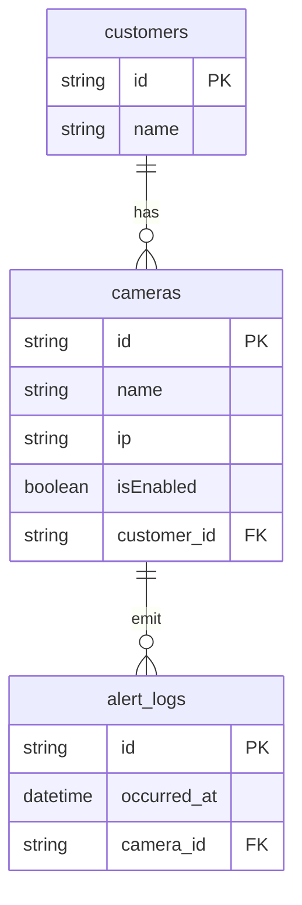

A Gabriel é uma startup focada em proteger pessoas. Com isso, buscamos talentos capazes de construir sistemas com foco em segurança e escalabilidade. Para descobrir se você é o próximo talento a integrar o nosso time, queremos propor o desafio a seguir.

#### Desafio

Implementar uma API web, utilizando o padrão REST, para gerenciamento de câmeras dos nossos clientes. Através de sua API deve ser possível:

- Adicionar novas câmeras
- Desabilitar uma câmera
- Listar as câmeras de um cliente
- Registrar ocorrência de alertas
- Obter ocorrências de alertas por intervalo de tempo

#### Regras de Negócio

- Não é permitida mais de uma câmera com mesmo IP por cliente
- Não há máscara de rede, porém o formato do IP precisa ser válido
- Uma câmera está obrigatoriamente associada a um único cliente
- Um alerta está obrigatoriamente associado a uma única câmera



#### Critérios de Aceitação

- Deve ser possível filtrar câmeras por estado (hab./desabilitada)
- Deve ser possível filtrar as ocorrências de alerta:
  - Por cliente
  - Por intervalo de tempo válido
  - A partir de uma data/hora válida
  - Se nenhum intervalo for passado, retorne as ocorrências do dia.

Com exceção das regras de negócios citadas no Desafio, nenhum erro precisa de tratamento específico. Entretanto, a API não deve retornar informações técnicas sobre erros não tratados, tais como mensagens de exceções ou pilha de execução (stack trace).

#### Iniciar o projeto

para iniciar o projeto executar o comando: `docker-compose-up`

Em seguida execute os seguintes comandos:

```
# Instalar as dependências
yarn

# Subir o Docker
docker-compose up

# Rodar as migrações
npx prisma migrate dev

# Rodar o seed
npx prisma db seed

# Iniciar a aplicação
yarn start:dev
```

#### API

A Documntação da Api está disponivel no link abaixo.

[Documentação da Api](https://documenter.getpostman.com/view/29520786/2s9YXcdjXm)
